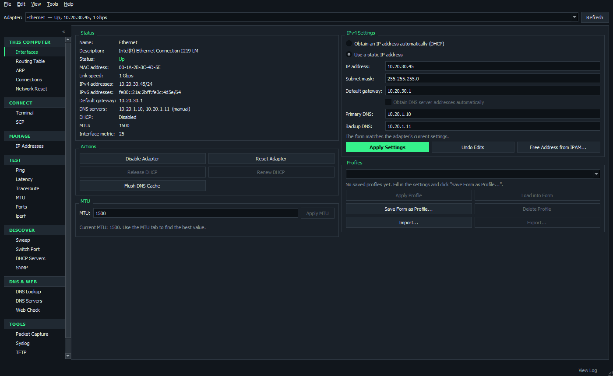
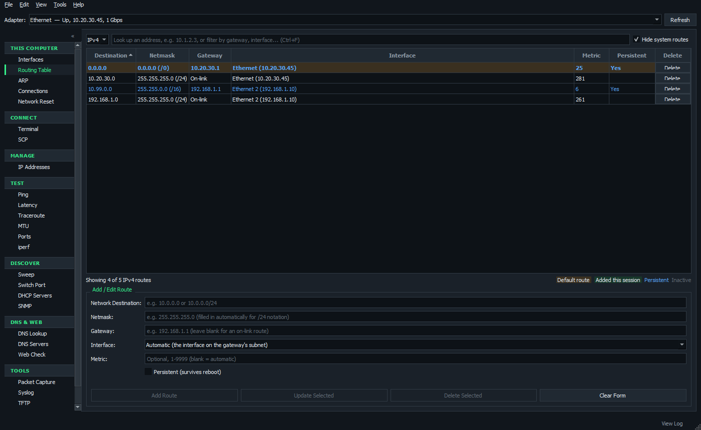
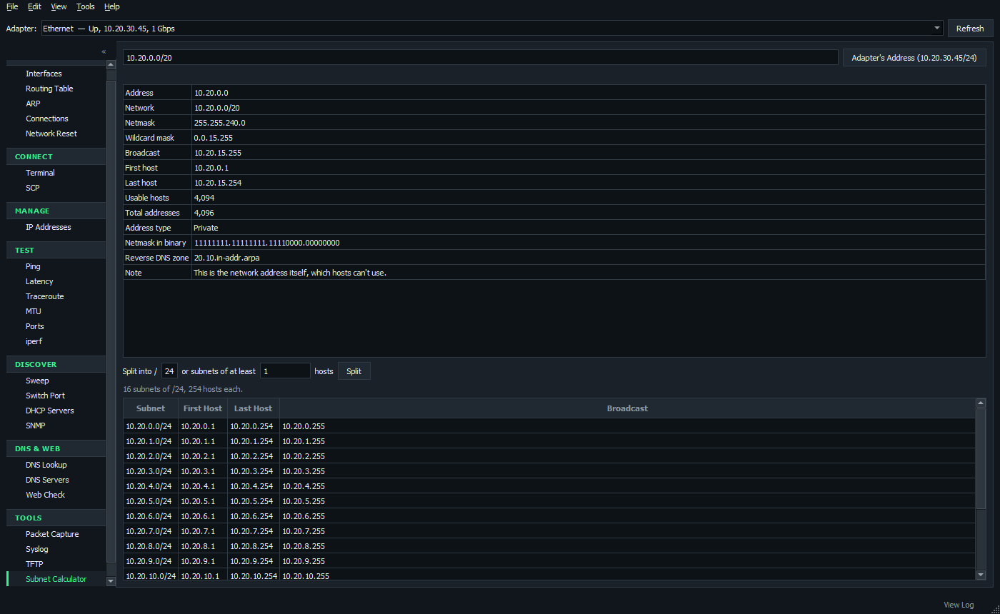
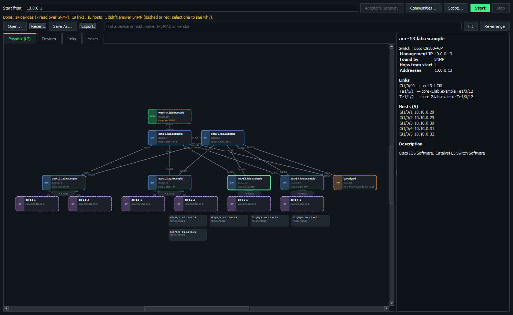
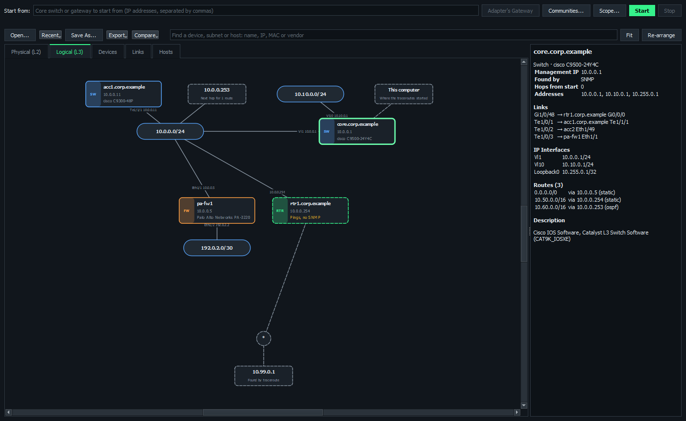
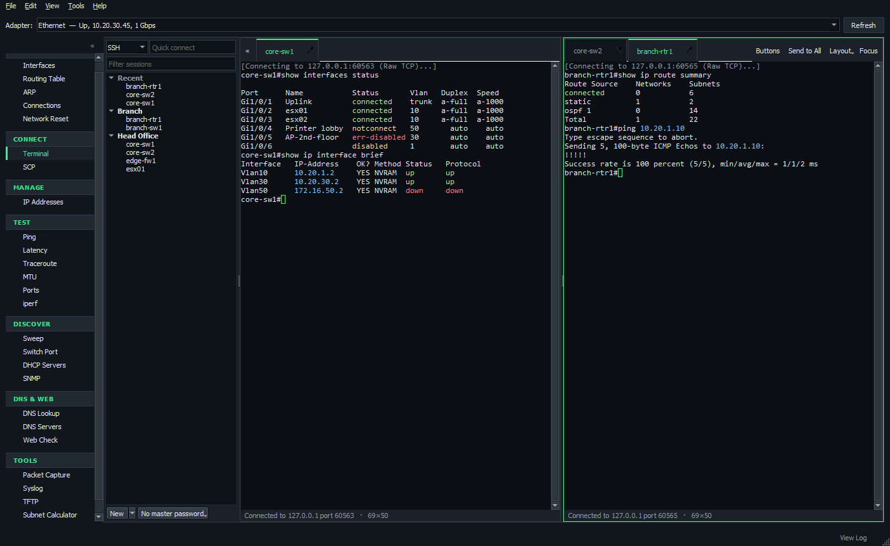
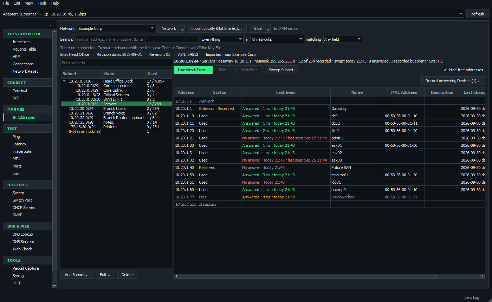
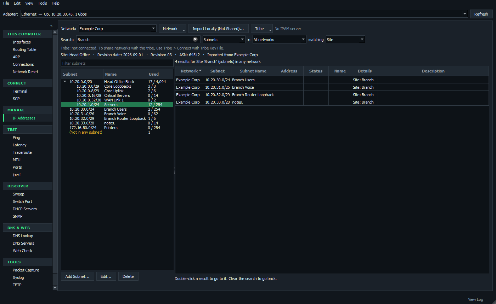
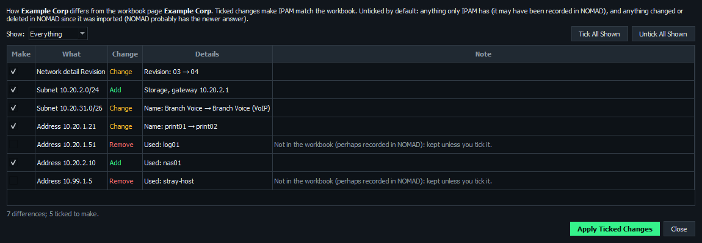
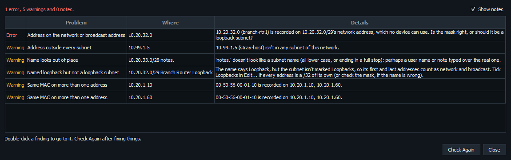

# NOMAD

**Network Operations, Monitoring And Diagnostics**: one Windows app to set up network adapters, troubleshoot networks, talk to devices and keep track of IP addresses. (Formerly NIC Manager, with the RADAR subnet sweep and the Latenct latency monitor built in.)

- **Works offline.** Tests only talk to the hosts you give them, and the MAC vendor list is built in.
- **One exe, nothing to install.** `NOMAD-<version>.exe` runs on its own ([build it](#running-from-source-and-building) with `build.ps1`).
- **Safe changes.** New IP settings, and disabling an adapter, revert on their own unless you confirm within 15 seconds, so a change that cuts off your remote session undoes itself.

Screenshots use made-up demo data.

## Contents

- [Getting around](#getting-around)
- [Pages](#pages)
- [Network map](#network-map)
- [Terminal and SCP](#terminal-and-scp)
- [IP address management (IPAM)](#ip-address-management-ipam)
- [Sharing IPAM with the tribe](#sharing-ipam-with-the-tribe)
- [Good to know](#good-to-know)
- [Running from source and building](#running-from-source-and-building)

## Getting around

- Pick a page from the **sidebar** (Ctrl+Tab and Ctrl+Shift+Tab move between pages). Hide it with **«**, View > Show Sidebar or Ctrl+B.
- Pick an **adapter** at the top of the window. Interfaces, MTU, Ping, Sweep, DHCP Servers and other pages work with it.
- **F11** (focus mode) hides everything but the current page.
- **View > Text Size** scales all text from 90% to 200% (Ctrl+= and Ctrl+- too, and Ctrl+0 to reset).

## Pages

### This Computer

| Page | Function |
| --- | --- |
| **Interfaces** | The adapter's status, addresses, gateway, DNS, speed and MAC. Switch between DHCP and a static IP (CIDR like `192.168.1.10/24` works), set DNS and MTU, and enable, disable, reset, release or renew. **Free Address from IPAM** fills in the next free address in a subnet you pick. Save settings as **profiles** to switch networks in one click. |
| **Routing Table** | View, filter, add, edit and delete IPv4 and IPv6 routes, persistent ones included. Type an address in the filter to see which route Windows would use for it. |
| **ARP** | Which MAC answers for each IP, with vendors. Warns about possible ARP spoofing and address conflicts. |
| **Connections** | Every TCP connection and listening port with the program that owns it, like `netstat -ano`. |
| **Network Reset** | Flush DNS, clear ARP, renew DHCP, reset Winsock and TCP/IP, and turn off a leftover proxy. |

### Connect

| Page | What it does |
| --- | --- |
| **Terminal** | SSH, Telnet, serial and raw TCP sessions in tabs, tiles and pop-out windows. [More below.](#terminal-and-scp) |
| **SCP** | A WinSCP-style file manager for SSH servers. [More below.](#terminal-and-scp) |

### Manage

| Page | Functions |
| --- | --- |
| **IP Addresses** | IP address management for several separate networks, shared with the tribe through an IPAM server and usable offline. [More below.](#ip-address-management-ipam) |

### Test

| Page | Functions |
| --- | --- |
| **Ping** | Ping with a running summary; quick buttons for the gateway and DNS server. |
| **Latency** | Watches several hosts at once, with gauges, a graph over time (lost pings in red) and optional CSV logging. |
| **Traceroute** | Loss, latency and jitter for every hop, like MTR/WinMTR. Every hop is probed at once, so a trace takes seconds. |
| **MTU** | Finds the largest MTU that reaches a host without fragmenting, and applies it. |
| **Ports** | Open, closed or filtered, for common port presets or any list and range. |
| **iperf** | Bandwidth tests with a built-in iperf3-compatible client and server. |

### Discover

| Page | Functions |
| --- | --- |
| **Sweep** | Finds every host on a subnet (ping, plus ARP on local subnets), with names, MACs and vendors. **Compare with IPAM** shows which hosts IPAM has, is missing or records with a different MAC. |
| **Network Map** | Crawls switches, routers and firewalls over SNMP from a starting device and draws what's plugged into what (CDP/LLDP), with the hosts on each switch port, and the subnets and routes between them. See [Network map](#network-map). |
| **Switch Port** | Which switch, port and VLAN you're plugged into, from LLDP and CDP. |
| **DHCP Servers** | Every DHCP server that answers, with each option it offers decoded, and warns about rogue servers. Nothing is leased. |
| **SNMP** | Walk or get over SNMP v1/v2c, with presets and a per-port interface summary. |

### DNS & Web

| Page | Functions |
| --- | --- |
| **DNS Lookup** | A, AAAA, MX, TXT and other records, from any DNS server. |
| **DNS Servers** | Times how fast each DNS server answers, and checks reverse (PTR) records. |
| **Web Check** | DNS, connect, TLS and first-byte timings, the certificate, and redirects. |

### Tools

| Page | Functions |
| --- | --- |
| **Packet Capture** | Captures to a pcapng file for Wireshark with Windows' built-in pktmon. Nothing to install. |
| **Syslog** | Receives syslog from network devices, coloured by severity and filterable. |
| **TFTP** | A TFTP server and client for firmware and config transfers. |
| **Subnet Calculator** | Network, mask, host range and counts for IPv4 and IPv6, and splitting a network into smaller subnets. |
| **Wake-on-LAN** | Wake a computer by its MAC, and save the ones you wake often. |

## Network map

Enter a core switch or your gateway (or use **Adapter's Gateway**) and click **Start**. NOMAD reads the device's CDP and LLDP neighbors over SNMP, then asks each neighbor for its neighbors, and so on. Nothing needs installing on the devices, and nothing is changed on them.

- **While it maps:** the map is drawn as devices are found, with the ones being read ringed in green (you can drag things around meanwhile). A progress bar shows how many devices have been read, are being read and are queued, the time taken and roughly how long is left. The **Crawl** tab shows what each device being read is doing (which table, which VLAN, which community string it's trying) and a log of everything found, skipped and why (outside the scope, too many hops, no answer), which you can copy or save. Community strings are never written to the log.
- **Community strings:** **Communities...** holds the ones to try, in order, plus ones for particular subnets (tried first there). They're saved encrypted for your Windows account. SNMP v1 and v2c.
- **Scope:** **Scope...** limits the crawl to subnets (by default any private address), a number of hops and a number of devices, and sets how many devices are read at once (16; up to 64 for a big network). Devices outside it still appear as neighbors, just without their own neighbors.
- **Hosts:** each switch's MAC table (per VLAN on Catalyst IOS, using `community@vlan`, only for the VLANs its access, voice and native trunk ports use, several at once) and the routers' and firewalls' ARP tables put hosts on the edge ports they're plugged into. MACs learned on uplinks are left out, and phones get their names from CDP/LLDP. Hosts are hidden until you double-click a switch (or tick **Show Hosts** for every switch): then there's a box per port listing each host with its VLAN. A port with many hosts and no neighbor is marked as a likely unmanaged switch or hypervisor.
- **Reading the map:** colours show the kind of device (switch, router, firewall, access point). A dashed outline is a device NOMAD didn't read itself: one only seen as a neighbor, or one that **pings but doesn't answer SNMP** (usually the community string or an SNMP ACL). Red means it answered neither. Palo Alto firewalls are found through LLDP, so turn on an LLDP profile on the interfaces facing the switches.
- **Adding and removing hosts:** a device that's turned off or unplugged while you map won't be found, so add it by hand: right-click a switch (or a port's box, or the Hosts tab) > **Add Host...** and give its port and a name, IP or MAC. Hand-added hosts are drawn dashed and kept when you map again; if one is later found for real, the crawl's entry takes over and keeps your name and note. Right-click hosts (or select them on the Hosts tab and press Delete) to edit or delete them. A deleted host that's still plugged in comes back the next time you map.
- **Adding devices and drawing links:** for a device the crawl can't find (an unmanaged switch, or one SNMP can't reach), right-click the map's background > **Add Device Here...**, or a device > **Add Device Linked to This...**, and give it a name, an IP address, its kind and model. To link two devices yourself (a port with CDP and LLDP turned off, say), right-click one > **Draw Link from Here** and click the other, then give the ports (or use **Add Link...**). Devices added by hand have their names in italics and links drawn by hand are dotted. A device with an address is checked over SNMP with your community strings, like the crawl's devices: it's dashed with *Pings, no SNMP* when the community or an SNMP ACL is wrong, and red when it doesn't answer at all (right-click > **Check SNMP Again**). It's pinged while monitoring, like the others. They're kept and checked again when you map again; once the crawl finds the device (by its address or name), the crawl's entry takes over its links, hosts, group and note, and a link drawn by hand goes once the crawl finds a link between the same two devices. Right-click them to edit or delete them.
- **Logical (L3) view:** the routers, L3 switches and firewalls joined through the subnets they have addresses in, with the next hops their routes point to. After the crawl, NOMAD traceroutes from this computer to what SNMP couldn't show (devices that didn't answer, next hops that aren't on the map, and static routes' destinations) and draws the paths it found, dashed, with `*` where a hop didn't answer. Select a router to see its IP interfaces and routes, or a subnet to see what's on it (right-click it to sweep it). Traceroute can be turned off under **Scope...**.

- **Working with it:** scroll to zoom and drag the background to move around. Drag devices where you want them (NOMAD remembers, even after mapping again); to move several at once, hold **Shift** and drag a box round them (Ctrl+click adds or removes one, Ctrl+A selects everything), then drag any of them. **Ctrl+F** goes to the find box, which works on the tab showing: it finds a device on either map, filters the rows of the Devices, Links or Hosts tab as you type, or finds text in the crawl log. **Find** jumps to a device or host by name, IP, MAC or vendor. Right-click a device for SSH, ping, SNMP and the rest, **Crawl from Here** (which adds what it finds to this map, reading only devices that weren't read yet), **Put at the Top**, or **Show in** the physical or logical view, the Devices tab or the Links tab (all its links). The Devices, Links and Hosts tabs list everything, with Excel-style filters: click the funnel at the left of a column's header (or right-click the header) to tick the values to show, search them, or sort (such as a Kind, a Switch or a VLAN); filters on several columns combine, and the tab shows how many rows are left (Hosts (12 of 340)). Double-click a row to see it on the map, or right-click it (on the Links tab, to show both ends of a link).
- **Sites and buildings:** select devices, right-click > **Group** > **New Site or Building...** to draw a labelled box round them (a building can sit inside a site). Drag a device into a box to add it, or out of one to take it out; drag a box's title to move everything in it. Double-click the title to collapse the group into one box that keeps its links to the rest of the map, which is handy for a big campus; finding a device inside opens it again. Select a group to see its devices, how many are down and its links out. Groups are saved with the map, carried over when you map again, shown in the Devices tab's Group column (to filter on), and exported to draw.io as boxes.
- **Arranging:** **Re-arrange** lays the map out again; its arrow chooses **Top to Bottom**, **Left to Right**, **Grid** or **Circle** (rings round the core), and with **Keep Sites and Buildings Together** each group is laid out inside its own box and the boxes are tiled. Select several devices and right-click (or use the arrow) to arrange just them where they are, or **Align** them by their left, center, right, top, middle or bottom edges and **Distribute** them evenly. Right-click a group's title to arrange just that group. Ctrl+click (or Shift-drag round) the titles of several sites, buildings or rooms, with devices too if you like, to drag them together, arrange them, or align and distribute them; each group moves as one box with everything in it.
- **Saving and exporting:** each map is saved automatically (reopen it with **Recent** or **Open**). **Export** saves the view showing as a picture (PNG or SVG) or a draw.io file (which Visio can import), or the devices, links or hosts as CSV.
- **Monitoring:** tick **Monitor** (and choose how often, every 10 s to 10 min) to ping every device on the map and see which are up: a green dot and the response time, or a red tint and how long it's been down. A device counts as down after missing two checks in a row, so one lost ping doesn't make it flap. The Devices tab gets a Status column to filter on, and the **Monitor** tab logs each device going down or coming back (with how long it was down); the history is saved with the map. Monitoring carries on while you use other pages, and starts again with NOMAD if it was on.
- **Watching for new devices:** tick **Watch** to have what's plugged into the network added to the map as it appears. Every few minutes each switch NOMAD read is asked for its CDP and LLDP neighbors (two short tables, not a whole crawl); a switch with a new neighbor is read again at once, the way **Crawl from Here** does, so a new switch, router, firewall or access point goes on the map beside the port it was seen on, with its links and hosts. Every hour (or as often as you choose on the **Watch** tab) every switch's MAC table is read again for new hosts. What's found is tagged **NEW** (a green tag on a device, a dot beside a host, and a New column on the Devices and Hosts tabs to filter on) until you right-click it > **Mark as Seen**, or **Mark All as Seen** on the Watch tab, which also logs what was found and where. A host that was on the map in the last 30 days isn't new, and devices you deleted stay off. For news the moment it happens, set the switches to send syslog and SNMP traps to the computer watching (the Watch tab lists the lines to paste into a Cisco switch): a port coming up, a CDP or LLDP change or a MAC address learned has that switch read 45 seconds later. Watching shares UDP 514 with the Syslog page, and carries on while you use other pages.
- **Tribe maps:** join the tribe with **Tribe** > **Join the Tribe with a Key File...** (the same key file as for [sharing IPAM](#sharing-ipam-with-the-tribe); joining on either page joins both, and **Leave the Tribe...** leaves both). On the tribe server itself, run NOMAD as administrator and it uses the server's own key, as the IP Addresses page does. Then **Tribe** > **Share This Map with the Tribe...** keeps the map on the tribe's IPAM server, with its community strings and scope, and everyone with the tribe key can open it from **Tribe**. Changes anyone makes (moving devices, groups, hosts and devices added by hand, mapping again, what watching finds) reach the others within seconds. Changes are merged item by item, so two people moving different devices both keep theirs; when two change the same thing, the later change wins. A tribe map opens and can be changed without the server, and the changes are sent when it's back. Only one computer watches a tribe map at a time (the others show who, and stand by), so the network isn't read twice; if it stops, another takes over. **Tribe** also renames or deletes a tribe map, or keeps a copy on this computer only.
- **Map Watcher service:** the tribe server may not be able to reach the switches, so watching runs where they can be reached. To watch while nobody has NOMAD open, install **Tools** > **Map Watcher Service...** on a computer that's usually on (as administrator), and tick the tribe maps for it to watch. It takes over from NOMAD left open elsewhere, listens for the switches' syslog and traps (opening UDP 514 and 162 in Windows Firewall), and adds what it finds to the tribe maps. Its settings and log are in `%ProgramData%\NOMAD\watcher`.
- **What changed:** **Compare** lists the differences from an earlier map: devices and links that appeared or went away, devices that changed (such as one that stopped answering SNMP), and hosts that moved to another port. New devices are ringed in green and changed ones in amber; double-click a difference to see it on the map.

## Terminal and SCP

**Sessions**

- Save sessions in folders, and import them from PuTTY or a SecureCRT export.
- **Quick connect** takes `admin@10.0.0.1`, `telnet 10.0.0.5`, `raw 10.0.0.9:9100` or `COM3:115200`.
- **Recent** at the top of the list keeps your last 10 connections.
- **Layout** tiles sessions side by side, stacked, or in a 2 × 2 or 3 × 2 grid. Drag tabs between panes and windows.
- Pop any tab out into its own window (right-click the tab).

**Working with many devices**

- **Send to All** sends a command (or Ctrl+C, Ctrl+Z, Ctrl+Shift+6...) to every session, and **Type in All** mirrors your typing.
- **Command buttons** send saved commands or blocks of configuration with one click, or with Ctrl+1 to Ctrl+9 (even with the Buttons bar hidden). Drag a button, or right-click it > Move to Position, to change the order and so its hotkey.
- **Keyword highlighting** colours down, err-disabled, % Invalid, up, and IP and MAC addresses. Change the rules in View > Terminal Keyword Highlighting.

**Staying connected**

- A per-session **line delay** keeps slow consoles from dropping pasted text.
- **Reconnect automatically** when a device reloads.
- **Anti-idle** keystrokes keep exec-timeout from logging you out.

**Security**

- SSH logs in with a password, an OpenSSH private key, or Pageant/SSH agent.
- Saved passwords are encrypted for your Windows account (DPAPI). Add a **master password** (AES-256) for more protection.
- Host keys are remembered, and NOMAD warns if one changes.
- Older switches that only speak SHA-1 SSH algorithms still connect.

**Serial**

- Serial sessions list the COM ports present, and can send a break (for Cisco ROMMON).

**Keys**

- Ctrl+Shift+F finds text, Shift+PgUp scrolls back, and Ctrl+mouse wheel zooms.
- Keys like Ctrl+B and F5 go to the device, not to NOMAD.

**SCP** is a WinSCP-style file manager using the same saved sessions:

- Drag files between your computer and the server, or press F5.
- F4 edits a remote file in place; F2 renames, F7 makes a folder, F8 deletes.
- Change permissions and owners (chmod and chown).
- **Work as Root** (sudo) browses, copies and edits as root.
- Transfers queue with progress, can be paused and resumed, and can be checked with SHA-256.
- **Synchronize** compares a local and a remote folder and copies the differences.

## IP address management (IPAM)

The **IP Addresses** page keeps track of addresses for several separate networks, such as air-gapped ones that reuse the same ranges.

**Everyday use**

- **Subnets as a tree** (blocks hold the subnets inside them), each with how much is used.
- **Every address** in a subnet as used, reserved or free, or as its network, broadcast or gateway address.
- **Use Next Free** records the lowest free address.
- **Loopback subnets:** every address is its own /32, with no network, broadcast or gateway address.
- **Select several** addresses or subnets to change them together.
- **Find Free Blocks** (right-click a subnet) shows the unused space in it, ready to add new subnets in.

**Sweeps and Last Seen**

- **Sweep Subnet** pings every address in place. **Last Seen** shows when each address last answered:
  - red where IPAM says used but nothing answered;
  - amber where something answered that IPAM doesn't have.
- **Record Answering Devices** and **Update MACs** save what a sweep found.
- Sweep results are kept, and shared through the IPAM server with who swept, including sweeps made offline.

**Search**

Search every network, or narrow it to subnets, addresses, one network, or one field (such as a name, a MAC, or a detail column from your workbook).

**Workbooks**

- **Import Spreadsheet** reads your addressing workbook (`.xlsx`, a network per page, or a `.csv` of one page).
  - Where a page's summary and its detailed listing disagree, you choose which to keep.
  - Impossible gateways get a suggested fix.
  - Unusable rows are listed by row number.
  - SNMP strings are never imported.
- **Export to Workbook** writes networks back in the same layout, and it imports back unchanged. **Export to CSV** is there too.
- **Compare with Workbook** lists every difference from a newer copy of the workbook to tick and apply, instead of importing it again. Edits made in NOMAD since the import are left unticked.

**Checking and history**

- **Check Data** lists likely mistakes, most serious first. Double-click one to go to it. It looks for:
  - a device on a network or broadcast address;
  - addresses outside every subnet;
  - names that look like a stray note;
  - "Loopback" subnets not marked as loopbacks;
  - duplicate MACs, and more.
- **History** shows every change with who made it and when: an address, a subnet, or the whole network.
- **View As Of** shows a network as it was at any moment.

**On the Interfaces page**, **Free Address from IPAM** fills in the next free address, mask and gateway. It records the address in IPAM once you keep the new settings.

## Sharing IPAM with the tribe

Networks are either **Local** (on this computer) or **Tribe** (shared by an IPAM server on one always-on Windows machine).

**Setting up the server**

1. On the server machine, run NOMAD as administrator and open **Tools > IPAM Server**.
2. Click **Install Service**. It sets up the database, a certificate and nightly backups (kept 14 days) in `%ProgramData%\NOMAD\server`, installs the NOMAD IPAM Server service, and opens TCP port 8443.
3. **Save Tribe Key File** and give it only to the tribe: anyone with it can change the tribe's IPAM. **Change Tribe Key** locks out every old copy.
4. After updating NOMAD, click **Update Service** in the same window.

Spreadsheets are imported, and tribe networks added or deleted, only in NOMAD on the server itself (running as administrator).

**On each laptop**

1. **Tribe > Connect with Tribe Key File** here, or **Tribe > Join the Tribe with a Key File** on the Network Map page (either joins both).
2. The laptop keeps a copy of the tribe's networks and history, so lookups work offline.
3. It syncs the moment anyone changes anything.

**Offline and conflicts**

- **Offline**, you can still assign, edit and free addresses. Changes wait as *pending* and are sent in order when the server is back.
- If someone else changed the same address first, **Review Refused Changes** lets you take the next free address instead, or discard yours.
- Subnets and networks can only be changed online.

**Troubleshooting:** stop the service and run `NOMAD.exe --ipam-server` to run the server in a console. Its log is `%ProgramData%\NOMAD\server\server.log`.

## Good to know

- **Administrator rights:** NOMAD starts without them, so viewing and testing work straight away. When a change needs them, it offers to restart as administrator (or use File > Restart as Administrator).
- **Diagnostics report:** Tools > Run Diagnostics Report (Ctrl+R) checks the adapter, gateway, DNS, internet access, route, path MTU and ARP table in about half a minute. It saves the findings as a web page to attach to a ticket.
- **Updating the MAC vendor list:** download https://standards-oui.ieee.org/oui/oui.csv and run `python -m nomad.oui build oui.csv`.

**Shortcuts**

| Keys | Does |
| --- | --- |
| F5 | Refresh |
| Ctrl+Tab / Ctrl+Shift+Tab | Next / previous page |
| Ctrl+B | Hide or show the sidebar |
| F11 | Focus mode |
| Ctrl+R | Diagnostics report |
| Ctrl+F | Search or filter on the page showing (routes, ARP, connections, syslog, IP addresses, network map) |
| Ctrl+1 to Ctrl+9 | The first nine command buttons (in a Terminal session) |
| Ctrl+= / Ctrl+- / Ctrl+0 | Text size |

**Where things are kept**

| What | Where |
| --- | --- |
| Terminal sessions and SSH host keys | `%APPDATA%\NOMAD\sessions.json`, `known_hosts` |
| Profiles | `%APPDATA%\NOMAD\profiles.json` |
| Local IPAM networks | `%APPDATA%\NOMAD\ipam.db` |
| Network maps | `%APPDATA%\NOMAD\maps` |
| Log (Tools > View Log) | `%LOCALAPPDATA%\NOMAD\nomad.log` |
| IPAM server | `%ProgramData%\NOMAD\server` |

The first time NOMAD runs, it moves over the folders and settings from NIC Manager.

## Running from source and building

    pip install -r requirements.txt
    pythonw Main.py

Tests, and a standalone exe (`dist\NOMAD-<version>.exe`):

    pip install -r requirements-dev.txt
    python -m pytest
    .\build.ps1

**Releases:** the version lives in `nomad\__init__.py`. Note changes under Unreleased in `CHANGELOG.md` as you go, then:

    python -m nomad.version bump patch     (or minor / major)
    git add -A
    git commit -m "Release X.Y.Z"
    git tag vX.Y.Z
    .\build.ps1

## Third-party software

NOMAD bundles PyQt5 (GPL), paramiko (LGPL 2.1) for SSH, pyte (LGPL 3) for terminal emulation, pyserial (BSD) for serial ports, openpyxl (MIT) for workbooks, and pywin32 (PSF) for the IPAM server service.

Happy troubleshooting!
